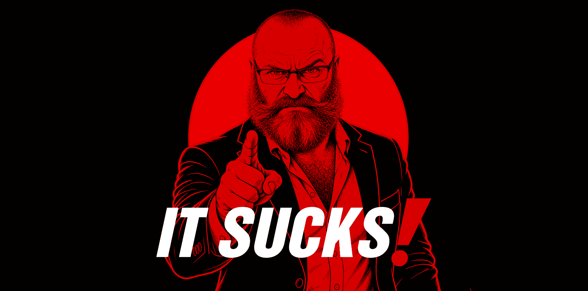

# About IT SUCKS!

**IT SUCKS! is an independent project built around articles, opinions, useful software, and solutions to things that probably should not have been annoying in the first place.**

What started primarily as a blog gradually became something broader. Alongside the Journal, IT SUCKS! develops lightweight WordPress plugins, Chrome extensions, small web utilities, and other practical tools.

The project favors software that is simple, focused, and useful. No unnecessary accounts, subscriptions, advertising, analytics, telemetry, or bloated collections of features simply because somebody decided every application needs to become a platform.

Some projects are created specifically for IT SUCKS!, while others begin because I need something myself and cannot find an existing solution that behaves the way I want.

Everything here is developed independently.

## Visual Appearance and Style

IT SUCKS! has a deliberately strong and recognizable visual identity built primarily around **red and black**. The project uses bold typography, high contrast, and distinctive red-and-black illustrations across articles, software pages, featured images, and promotional graphics.

The limited color palette is intentional. Rather than using generic stock imagery or constantly changing visual styles, IT SUCKS! uses its red-and-black artwork as part of the project's branding, helping articles, plugins, extensions, and other projects feel like parts of the same identity.

<!-- IMAGE PLACEHOLDER -->

## What IT SUCKS! Includes

IT SUCKS! is not only a blog. The project currently includes:

- articles, opinions, commentary, and practical guides;
- lightweight WordPress plugins;
- Chrome and Chromium browser extensions;
- small web tools and utilities;
- privacy-focused and performance-focused experiments;
- software created to solve annoyances encountered in everyday use.

The common idea is simple: if something is unnecessarily complicated, bloated, intrusive, badly designed, or simply irritating, it may eventually become an IT SUCKS! article or project.

## Project Timeline

### May 2026

**IT SUCKS! begins taking shape.**  
The project develops around `itsucks.fyi` as an independent home for articles, opinions, complaints, practical guides, and software. The idea quickly expands beyond being simply a blog.

**May 21, 2026 — WordPress becomes an important part of the project.**  
The article *Disable AI in WordPress 7.0* is published together with a practical MU plugin, establishing a pattern that would become common for IT SUCKS!: complain about something, explain the problem, and occasionally provide a way to fix it.

**May 22, 2026 — IT SUCKS! starts developing its own WordPress plugins.**  
Scheduled Articles Box is already running on the website, and plans begin to make selected plugins publicly available.

**May 24–28, 2026 — The plugin collection grows.**  
Work includes Share Buttons Lite and Mini Outgoing Firewall, with the emphasis settling on small, focused plugins rather than giant all-purpose packages.

**May 26, 2026 — Browser extensions join the project.**  
Development of *No Autoplay, Thanks!* produces a lightweight Chrome/Chromium extension designed around compatibility, local processing, and minimal interference with websites.

### August 2026

**August 12, 2026 — Comment tools become another project area.**  
Comment Status Notifications is refined into a more portable WordPress plugin, alongside experiments with lightweight content-notification tools.

**August 20, 2026 — First Chrome Web Store approval.**  
*No Autoplay, Thanks!* is approved for the Chrome Web Store under the IT SUCKS! project. Dedicated extension and privacy pages are added to the website.

**August 21, 2026 — The browser-extension collection expands.**  
Development and documentation continue for *Simple X Video Downloader*. The project philosophy becomes increasingly explicit: free software, minimal data handling, no advertising, and no analytics.

### September 2026

**September 2026 — The website and software are refined rather than simply expanded.**  
Existing extensions and WordPress tools receive compatibility, reliability, privacy, and interface improvements. The project increasingly develops a shared visual and technical identity instead of treating every tool as an unrelated experiment.

**September 29–30, 2026 — Another round of extension and WordPress development.**  
*No Autoplay, Thanks!* reaches version 1.2.2, work continues on WordPress cleanup and privacy utilities, and *Milan's RedGifs Video Downloader* enters active development.

### October 2026

**Early October 2026 — The visual identity is tightened.**  
The IT SUCKS! branding becomes more consistent around **red and black imagery**, strong contrast, bold typography, and stylized illustrated artwork. The current primary red settles around `#d10000`, paired with black and, where a light surface is required, the warmer `#f7f1e7` background.

The red-and-black illustrations become more than individual featured images. They develop into a recognizable visual language for the project itself.

**October 5, 2026 — The IT SUCKS! WordPress.org account is approved.**  
After months of waiting and follow-up, the project account becomes available for publishing and managing WordPress plugins and themes.

**October 6, 2026 — The extension collection continues growing.**  
*Video Downloader for X* and *Milan's RedGifs Video Downloader* are formally documented as IT SUCKS! projects, with dedicated privacy documentation and Chrome Web Store preparation and review work.

## Project Philosophy

IT SUCKS! does not try to turn every idea into a giant product.

A useful tool can be small. A browser extension can do one thing. A WordPress plugin does not need advertising, telemetry, an account system, a cloud dashboard, twelve premium tiers, or a permanent relationship with somebody else's server.

When possible, IT SUCKS! projects aim to be:

- lightweight;
- privacy-friendly;
- understandable;
- focused on a clear purpose;
- free of unnecessary external connections;
- free of advertising, tracking, and telemetry;
- easy to remove if they are no longer needed.

## Still Evolving

IT SUCKS! does not have a grand five-year roadmap. New articles, plugins, extensions, and small utilities tend to appear when I encounter something irritating, unnecessarily complicated, privacy-hostile, or simply badly designed.

Some ideas become permanent projects. Some get rewritten. Some disappear because there is a better way to do them.

**That is probably how it should be.**
